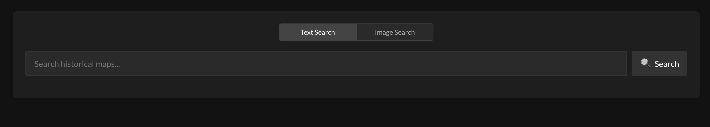
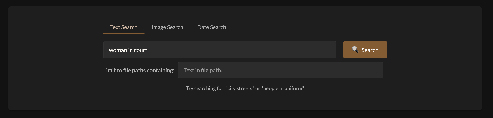
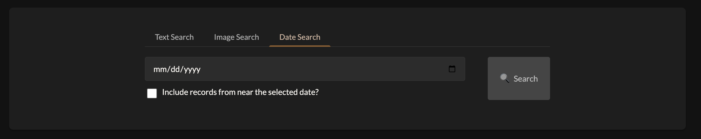

## Description

I made three changes, all specifically to the photograph part of the app. These were:

1) Allowing the app to run on photographs stored in S3, without having to locally store all of the raw images.
2) Adding a date search filter.
3) Adding an option to filter photographs by file path before running the embedding search.

## Motivation and Context

The first of these changes allows the app to scale to larger datasets of photographs. For use cases where there are over a million photos, it will be helpful to be able to run the app without having to store all of the photos locally.

The next two are to enable more specific photograph searching. This is particularly useful for contexts where a user might know about a specific photo they're looking for, but not know where to find it. By filtering based on date or file name they can get closer to finding the photo they want, and then layer the embedding search on top of that.

## Type of Change

<!-- Mark the relevant option with an "x" -->

- [ ] Bug fix (non-breaking change that fixes an issue)
- [x] New feature (non-breaking change that adds functionality)
- [ ] Breaking change (fix or feature that would cause existing functionality to not work as expected)
- [x] Documentation update
- [ ] Code refactoring (no functional changes)
- [ ] Performance improvement
- [ ] Research contribution (new models, evaluation methods, etc.)
- [ ] Other (please describe):

## Component(s) Affected

<!-- Mark all that apply -->

- [x] Backend (Python/FastAPI)
- [x] Frontend - Photographs
- [ ] Frontend - Maps
- [ ] Frontend - Documents
- [ ] CLIP/ML models
- [x] Configuration
- [x] Documentation
- [ ] Tests
- [x] Build/deployment

## Changes Made

<!-- List the main changes in bullet points -->

- Updated the generate_embeddings script to be able to download files from S3.
- Updated the generate_embeddigns script to store the origin date of a photograph into the metadata file.
- Updated the backend to fetch full photographs from S3 when they are not stored locally.
- Updated the backend to provide an API for date search.
- Updated the backend to enable file name filter on text search.
- Updated the photograph frontend to add a date search option.
- Updated the photograph frontend to include a filter bar below the text search, currently only including the file path filter.

## Testing

### How Has This Been Tested?

<!-- Describe the tests you ran and how to reproduce them -->

I ran manual tests on each aspect that I described above.

## Screenshots (if applicable)

<!-- Add screenshots to demonstrate UI changes -->

| Before | After |
|--------|-------|
|  |  |
| N/A |  |

## Checklist

<!-- Mark completed items with an "x" -->

### Code Quality

- [x] My code follows the project's coding standards
- [x] I have run `black .` and `isort .` on Python code
- [x] I have run `npm run lint` on frontend code (if applicable)
- [x] I have performed a self-review of my own code
- [x] I have commented my code, particularly in hard-to-understand areas
- [x] My changes generate no new warnings or errors

### Testing

- [ ] I have added tests that prove my fix is effective or that my feature works
I didn't see unit tests.
- [ ] New and existing unit tests pass locally with my changes
I didn't see unit tests.
- [x] I have tested this locally with actual data

### Documentation

- [x] I have updated the documentation accordingly
- [x] I have updated the README if needed
- [x] I have added docstrings to new functions/classes
- [x] I have updated `config.json` documentation if config changes were made

### Dependencies

- [x] I have updated `requirements.txt` (if Python dependencies changed)
- [x] I have updated `package.json` (if Node dependencies changed)
- [x] I have documented any new configuration options

### Research (if applicable)

- [ ] I have included references to relevant papers or research
- [ ] I have shared evaluation results or benchmarks
- [ ] I have included information about datasets used
- [ ] I have documented model training procedures

## Breaking Changes

<!-- If this PR contains breaking changes, describe them here -->
<!-- Include migration instructions for users -->

None / (describe breaking changes)

## Additional Notes

<!-- Any additional information that reviewers should know -->

## Reviewers Checklist (for maintainers)

- [ ] Code quality and style compliance
- [ ] Test coverage adequate
- [ ] Documentation complete
- [ ] No security concerns
- [ ] Performance implications acceptable
- [ ] Breaking changes documented
